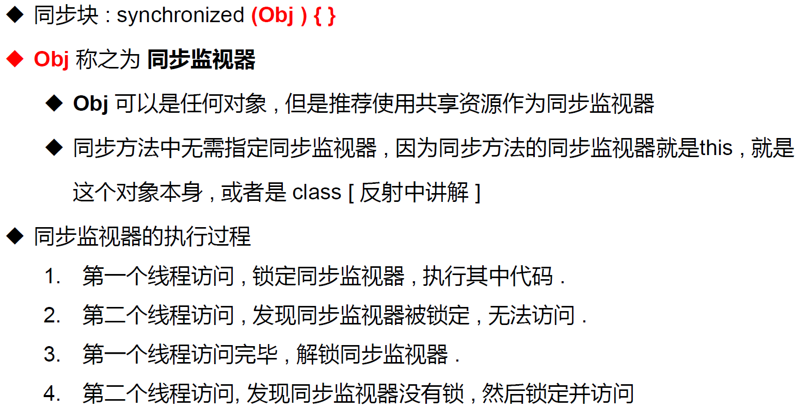

# 并发
并发 : 同一个对象被多个线程同时操作

# 线程同步
现实生活中,我们会遇到 ” 同一个资源 , 多个人都想使用 ” 的问题 , 比如,食堂排队 打饭 , 每个人都想吃饭 , 最天然的解决办法就是 , 排队 . 一个个来. 处理多线程问题时 , 多个线程访问同一个对象 ,
并且某些线程还想修改这个对象 . 这时候我们就需要线程同步 . 线程同步其实就是一种等待机制 , 多个需要同时访问 此对象的线程进入这个对象的等待池形成队列, 等待前面线程使用完毕 ,
下一个线 程再使用

# 线程同步的形成条件
队列 和 锁

# 线程同步机制

由于同一进程的多个线程共享同一块存储空间 , 在带来方便的同时,也带来了访问 冲突问题 , 为了保证数据在方法中被访问时的正确性 , 在访问时加入锁机制 synchronized,
当一个线程获得对象的排它锁 , 独占资源 , 其他线程必须等待 , 使用后释放锁即可 . 存在以下问题 :
1.一个线程持有锁会导致其他所有需要此锁的线程挂起 ; 2.在多线程竞争下 , 加锁 , 释放锁会导致比较多的上下文切换 和 调度延时,引 起性能问题 ; 3.如果一个优先级高的线程等待一个优先级低的线程释放锁 会导致优先级倒 置 ,
引起性能问题 .

# 同步方法

# 同步的弊端

# 同步块

